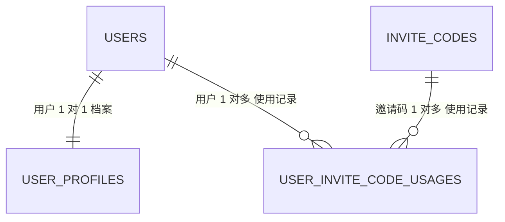
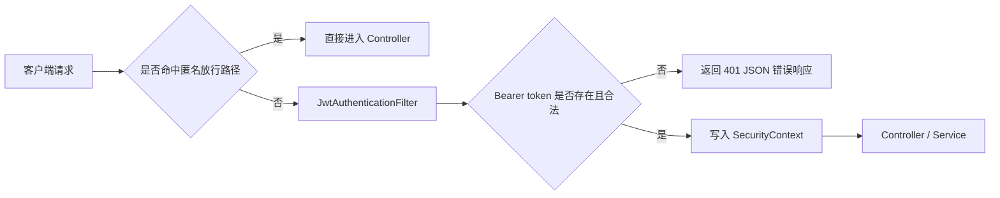

# DailyForge Auth 模块详细设计文档（DDD）
> 版本：v1.1 | 日期：2026-07-12 | 模块归属：`backend` 单体应用 `com.dailyforge.modules.auth`

---

## 一、方案概述

### 1.1 模块目标

`auth` 模块负责 DailyForge 的账户注册、登录认证、JWT 双令牌签发、当前用户获取、邀请码权益升级，以及相关安全基础设施落地。

本模块是后续以下能力的前置依赖：

- `profile`：个人资料维护需要登录用户上下文
- `plan`：训练计划归属到用户
- `workout`：训练打卡需要身份鉴权
- `nutrition`：饮食建议与限制依赖账户权益
- `ai`：AI 功能开通依赖 `accountTier`
- `stats`：平台统计页依赖 `platformRole=admin`

### 1.2 当前交付范围

| 序号 | 功能 | 说明 | 状态 |
|------|------|------|:---:|
| 1 | 用户注册 | 支持注册时直接输入邀请码 | 已完成 |
| 2 | 用户登录 | 校验邮箱密码并返回 JWT 双令牌 | 已完成 |
| 3 | 当前用户信息 | 返回数据库最新身份信息 | 已完成 |
| 4 | 刷新令牌 | 使用 refresh token 换发新的 token 对 | 已完成 |
| 5 | 退出登录 | 第一版为空操作，占位接口保留 | 已完成 |
| 6 | 兑换邀请码 | 登录后输入邀请码提升账户权益 | 已完成 |

### 1.3 核心约束

- 第一版使用单体 Spring Boot，不拆独立认证服务。
- 第一版使用无状态 JWT 方案，不使用 Cookie。
- 第一版不引入 Redis token 黑名单，不维护会话表。
- 邀请码第一版仅支持 `grant_type=account_tier`。
- 邀请码不允许赋予管理员权限。
- 一个邮箱只允许注册一个用户。
- 注册时如果传入邀请码且邀请码非法，整个注册事务失败。
- 注册成功时必须同步创建一条 `user_profiles` 初始化记录。
- `GET /api/auth/me` 返回数据库最新状态，不直接信任 token 内旧快照。

### 1.4 与现有基础设施的关系

当前已复用的公共基础设施：

- `ApiResponse`
- `ErrorCode`
- `BusinessException`
- `GlobalExceptionHandler`
- `SecurityConfig`
- `OpenApiConfig`

本模块新增的核心基础设施：

- `JwtProperties`
- `JwtTokenService`
- `JwtAuthenticationFilter`
- `AuthUserPrincipal`
- `AuthSecurityUtils`
- `RestAuthenticationEntryPoint`
- `RestAccessDeniedHandler`

---

## 二、关键决策

### 2.1 路由决策

- 保留 Controller 基础路径：`/api/auth`
- 删除全局 `server.servlet.context-path: /api`
- 最终外部路径统一为 `/api/auth/...`

### 2.2 安全决策

- `SecurityConfig` 放行 `/api/auth/**`
- 保留放行：
  - `/docs/**`
  - `/swagger-ui/**`
  - `/v3/api-docs/**`
  - `/actuator/health`
  - `/error`
- 会话策略固定为 `STATELESS`
- JWT 鉴权通过 `JwtAuthenticationFilter` 完成

### 2.3 DTO/VO 映射决策

- DTO/VO 与实体之间的响应映射统一使用 `MapStruct`
- 由 `AuthAssembler` 负责输出层对象拼装

### 2.4 登录态决策

- `AuthTokenResponse` 在登录和刷新接口复用
- `refresh-token` 响应也返回 `user` 摘要，减少前端额外请求
- `logout` 第一版不做 token 作废，仅校验登录态后返回成功

### 2.5 邀请码权益决策

- 当前仅支持 `grant_type=account_tier`
- 账户权益升级顺序：
  - `basic` < `invited_ai` < `premium`
- 不允许平级覆盖或降级覆盖

---

## 三、数据设计

### 3.1 使用表

| 表名 | 用途 |
|------|------|
| `users` | 账户主表，保存邮箱、密码、角色、权益、状态 |
| `user_profiles` | 用户档案表，注册时初始化 |
| `invite_codes` | 邀请码定义表 |
| `user_invite_code_usages` | 用户邀请码使用记录表 |

### 3.2 核心字段说明

#### users

| 字段 | 类型 | 说明 |
|------|------|------|
| `id` | `BIGINT` | 用户主键 |
| `email` | `VARCHAR(128)` | 唯一登录邮箱 |
| `password_hash` | `VARCHAR(255)` | BCrypt 哈希 |
| `user_name` | `VARCHAR(64)` | 用户名 |
| `platform_role` | `VARCHAR(32)` | 平台角色，当前 `user/admin` |
| `account_tier` | `VARCHAR(32)` | 权益层级，当前 `basic/invited_ai/premium` |
| `status` | `VARCHAR(32)` | 账户状态，当前 `active/disabled` |
| `last_login_at` | `DATETIME(3)` | 最近登录时间 |

#### user_profiles

| 字段 | 类型 | 说明 |
|------|------|------|
| `user_id` | `BIGINT` | 对应 `users.id` |
| `gender` | `VARCHAR(16)` | 可空 |
| `birth_date` | `DATE` | 可空 |
| `height_cm` | `DECIMAL(5,2)` | 可空 |
| `training_level` | `VARCHAR(32)` | 可空 |
| `goal_type` | `VARCHAR(32)` | 可空 |
| `injury_notes` | `VARCHAR(500)` | 可空 |

#### invite_codes

| 字段 | 类型 | 说明 |
|------|------|------|
| `id` | `BIGINT` | 主键 |
| `code` | `VARCHAR(64)` | 邀请码，唯一 |
| `information` | `VARCHAR(255)` | 邀请码说明 |
| `grant_type` | `VARCHAR(32)` | 当前固定 `account_tier` |
| `grant_value` | `VARCHAR(64)` | 目标权益，如 `invited_ai` |
| `max_uses` | `INT` | 最大可用次数 |
| `used_count` | `INT` | 已使用次数 |
| `expires_at` | `DATETIME(3)` | 过期时间，可空 |
| `status` | `VARCHAR(32)` | `active/disabled` |

#### user_invite_code_usages

| 字段 | 类型 | 说明 |
|------|------|------|
| `id` | `BIGINT` | 主键 |
| `user_id` | `BIGINT` | 使用用户 |
| `invite_code_id` | `BIGINT` | 使用的邀请码 |
| `used_at` | `DATETIME(3)` | 使用时间 |

### 3.3 关键约束

- `uk_users_email (email)`
- `uk_invite_codes_code (code)`
- `uk_user_invite_code_usages_user_code (user_id, invite_code_id)`

### 3.4 数据关系



---

## 四、领域规则

### 4.1 密码规则

当前 `PasswordPolicyService` 仅负责：

- 校验 `password` 与 `confirmPassword` 一致

对应错误码：

- `PASSWORD_CONFIRM_MISMATCH`

后续如果需要复杂密码强度规则，继续扩展该领域服务。

### 4.2 账户状态规则

| 状态值 | 含义 | 是否允许登录 |
|------|------|:---:|
| `active` | 正常可用 | 是 |
| `disabled` | 已禁用 | 否 |

非 `active` 状态统一抛：

- `ACCOUNT_DISABLED`

### 4.3 邀请码可用性规则

`InviteCodeDomainService.validateAvailability` 依次校验：

1. 邀请码存在
2. `status=active`
3. 未过期
4. `used_count < max_uses`

对应错误码：

- `INVITE_CODE_NOT_FOUND`
- `INVITE_CODE_DISABLED`
- `INVITE_CODE_EXPIRED`
- `INVITE_CODE_EXHAUSTED`

### 4.4 邀请码权益升级规则

`AccountTierPolicyService.resolveGrantedTier` 当前规则：

- 仅接受 `grant_type=account_tier`
- 允许 `basic -> invited_ai`
- 允许 `basic -> premium`
- 允许 `invited_ai -> premium`
- 不允许平级覆盖
- 不允许降级覆盖
- 不识别的权益值直接视为冲突

对应错误码：

- `INVITE_CODE_GRANT_CONFLICT`

---

## 五、安全设计

### 5.1 鉴权链路



### 5.2 组件职责

| 组件 | 作用 |
|------|------|
| `JwtProperties` | 读取 JWT 配置 |
| `JwtTokenService` | 生成、解析、校验 access/refresh token |
| `JwtAuthenticationFilter` | 从请求头提取 access token 并建立认证上下文 |
| `AuthUserPrincipal` | 当前登录用户 principal |
| `AuthSecurityUtils` | 在业务层获取当前用户 ID |
| `RestAuthenticationEntryPoint` | 未认证访问时返回统一 401 JSON |
| `RestAccessDeniedHandler` | 已认证但无权限时返回统一 403 JSON |

### 5.3 JWT 配置

配置前缀：

`dailyforge.security.jwt`

配置项：

| 配置项 | 含义 |
|------|------|
| `issuer` | JWT 签发者 |
| `secret` | HMAC 对称密钥，至少 32 字符 |
| `access-token-ttl` | access token 时长 |
| `refresh-token-ttl` | refresh token 时长 |

当前资源文件已补齐：

- `application.yml`
- `application-dev.yml`
- `application-prod.yml`

示例：

```yaml
dailyforge:
  security:
    jwt:
      issuer: dailyforge-backend
      secret: ${DAILYFORGE_JWT_SECRET:dailyforge-local-jwt-secret-key-change-me-1234567890}
      access-token-ttl: PT2H
      refresh-token-ttl: P14D
```

### 5.4 Token 设计

#### access token claims

| claim | 说明 |
|------|------|
| `sub` | 用户 ID |
| `typ` | 固定 `access` |
| `email` | 用户邮箱 |
| `platformRole` | 平台角色 |
| `accountTier` | 权益层级 |

#### refresh token claims

| claim | 说明 |
|------|------|
| `sub` | 用户 ID |
| `typ` | 固定 `refresh` |

### 5.5 安全错误码

| 错误码 | HTTP 状态 | 含义 |
|------|------|------|
| `UNAUTHORIZED` | 401 | 未登录 |
| `FORBIDDEN` | 403 | 无权限 |
| `TOKEN_INVALID` | 401 | token 非法 |
| `TOKEN_EXPIRED` | 401 | token 已过期 |
| `TOKEN_TYPE_MISMATCH` | 401 | token 类型错误 |

### 5.6 Swagger 安全说明

- `OpenApiConfig` 仅注册 `bearerAuth` 安全方案
- 不做全局安全要求绑定
- 受保护接口通过 `@SecurityRequirement(name = "bearerAuth")` 单独声明

这样可以保证：

- 注册、登录、刷新令牌在 Swagger 中可匿名调试
- `me`、`logout`、`redeem-invite-code` 明确展示 Bearer Token 需求

---

## 六、接口设计

### 6.1 接口总览

| 编号 | 方法 | 路径 | 需要 access token | 请求体 | 说明 |
|------|------|------|:---:|:---:|------|
| A1 | POST | `/api/auth/register` | 否 | 是 | 用户注册 |
| A2 | POST | `/api/auth/login` | 否 | 是 | 用户登录 |
| A3 | GET | `/api/auth/me` | 是 | 否 | 获取当前用户 |
| A4 | POST | `/api/auth/refresh-token` | 否 | 是 | 刷新令牌 |
| A5 | POST | `/api/auth/logout` | 是 | 否/可选 | 退出登录 |
| A6 | POST | `/api/auth/redeem-invite-code` | 是 | 是 | 兑换邀请码 |

### 6.2 统一响应模型

顶层统一为：

| 字段 | 类型 | 必填 | 说明 |
|------|------|:---:|------|
| `code` | `string` | 是 | 业务结果码 |
| `message` | `string` | 是 | 提示信息 |
| `data` | `object/null` | 是 | 业务数据 |

### 6.3 详细接口

#### 6.3.1 注册 `POST /api/auth/register`

请求 DTO：`RegisterRequest`

| 参数名 | 类型 | 必填 | 说明 |
|------|------|:---:|------|
| `email` | `string` | 是 | 用户邮箱，唯一登录账号 |
| `password` | `string` | 是 | 明文密码 |
| `confirmPassword` | `string` | 是 | 确认密码 |
| `userName` | `string` | 是 | 用户名 |
| `inviteCode` | `string` | 否 | 注册时可直接兑换的邀请码 |

响应 VO：`RegisterResponse`

| 参数名 | 类型 | 必填 | 说明 |
|------|------|:---:|------|
| `data.userId` | `number` | 是 | 用户 ID |
| `data.email` | `string` | 是 | 用户邮箱 |
| `data.userName` | `string` | 是 | 用户名 |
| `data.platformRole` | `string` | 是 | 平台角色 |
| `data.accountTier` | `string` | 是 | 当前权益层级 |
| `data.inviteCodeApplied` | `boolean` | 是 | 是否成功应用邀请码 |

实现逻辑：

1. 校验参数与确认密码。
2. 校验邮箱唯一。
3. 如果有邀请码，先做可用性校验。
4. 插入 `users`。
5. 插入 `user_profiles`。
6. 如果有邀请码，同事务内执行兑换逻辑。
7. 返回注册结果。

事务：

- `@Transactional`

#### 6.3.2 登录 `POST /api/auth/login`

请求 DTO：`LoginRequest`

| 参数名 | 类型 | 必填 | 说明 |
|------|------|:---:|------|
| `email` | `string` | 是 | 登录邮箱 |
| `password` | `string` | 是 | 明文密码 |

响应 VO：`AuthTokenResponse`

| 参数名 | 类型 | 必填 | 说明 |
|------|------|:---:|------|
| `data.accessToken` | `string` | 是 | 访问令牌 |
| `data.refreshToken` | `string` | 是 | 刷新令牌 |
| `data.expiresIn` | `number` | 是 | access token 有效秒数 |
| `data.user` | `object` | 是 | 用户摘要 |
| `data.user.userId` | `number` | 是 | 用户 ID |
| `data.user.email` | `string` | 是 | 邮箱 |
| `data.user.userName` | `string` | 是 | 用户名 |
| `data.user.platformRole` | `string` | 是 | 平台角色 |
| `data.user.accountTier` | `string` | 是 | 权益层级 |

实现逻辑：

1. 根据邮箱查询用户。
2. 不存在则抛 `USER_NOT_FOUND`。
3. 校验状态为 `active`。
4. 校验密码。
5. 更新 `last_login_at`。
6. 生成 token 对。
7. 返回 token 与用户摘要。

#### 6.3.3 当前用户 `GET /api/auth/me`

请求头：

| 参数名 | 类型 | 必填 | 说明 |
|------|------|:---:|------|
| `Authorization` | `string` | 是 | `Bearer <accessToken>` |

响应 VO：`CurrentUserResponse`

| 参数名 | 类型 | 必填 | 说明 |
|------|------|:---:|------|
| `data.userId` | `number` | 是 | 用户 ID |
| `data.email` | `string` | 是 | 邮箱 |
| `data.userName` | `string` | 是 | 用户名 |
| `data.platformRole` | `string` | 是 | 平台角色 |
| `data.accountTier` | `string` | 是 | 权益层级 |
| `data.status` | `string` | 是 | 当前状态 |

实现逻辑：

1. JWT 过滤器解析 access token。
2. `AuthSecurityUtils` 获取当前用户 ID。
3. 查询数据库最新用户信息。
4. 返回最新状态。

#### 6.3.4 刷新令牌 `POST /api/auth/refresh-token`

请求 DTO：`RefreshTokenRequest`

| 参数名 | 类型 | 必填 | 说明 |
|------|------|:---:|------|
| `refreshToken` | `string` | 是 | 刷新令牌 |

响应 VO：`AuthTokenResponse`

返回结构与登录接口完全一致，包含：

- `accessToken`
- `refreshToken`
- `expiresIn`
- `user`

实现逻辑：

1. 解析 refresh token。
2. 校验 `typ=refresh`。
3. 根据 `sub` 查询用户。
4. 校验用户状态。
5. 重新签发 token 对。
6. 返回 token 与用户摘要。

#### 6.3.5 退出登录 `POST /api/auth/logout`

请求 DTO：`LogoutRequest`

| 参数名 | 类型 | 必填 | 说明 |
|------|------|:---:|------|
| `refreshToken` | `string` | 否 | 预留字段，当前版本不处理 |

响应：

- 成功时 `data = null`

实现逻辑：

1. 校验 access token 有效。
2. 获取当前用户 ID。
3. 记录日志。
4. 直接返回成功。

#### 6.3.6 兑换邀请码 `POST /api/auth/redeem-invite-code`

请求 DTO：`RedeemInviteCodeRequest`

| 参数名 | 类型 | 必填 | 说明 |
|------|------|:---:|------|
| `code` | `string` | 是 | 待兑换的邀请码 |

响应 VO：`RedeemInviteCodeResponse`

| 参数名 | 类型 | 必填 | 说明 |
|------|------|:---:|------|
| `data.userId` | `number` | 是 | 用户 ID |
| `data.accountTier` | `string` | 是 | 兑换后的权益层级 |
| `data.inviteCode` | `string` | 是 | 本次兑换的邀请码 |

实现逻辑：

1. 获取当前登录用户 ID。
2. `selectByCodeForUpdate` 锁定邀请码。
3. 校验邀请码可用性。
4. 校验用户状态。
5. 校验用户是否已使用过该邀请码。
6. 计算目标权益层级。
7. 更新用户权益。
8. 写入使用记录。
9. 更新 `used_count`。
10. 返回兑换结果。

事务：

- `@Transactional`

---

## 七、代码结构设计

### 7.1 包结构

```text
com.dailyforge.modules.auth
├── application
│   ├── assembler
│   │   └── AuthAssembler.java
│   └── service
│       ├── AuthApplicationService.java
│       └── InviteCodeApplicationService.java
├── domain
│   └── service
│       ├── PasswordPolicyService.java
│       ├── InviteCodeDomainService.java
│       └── AccountTierPolicyService.java
├── infrastructure
│   └── persistence
│       ├── entity
│       │   ├── UserEntity.java
│       │   ├── UserProfileEntity.java
│       │   ├── InviteCodeEntity.java
│       │   └── UserInviteCodeUsageEntity.java
│       └── mapper
│           ├── UserMapper.java
│           ├── UserProfileMapper.java
│           ├── InviteCodeMapper.java
│           └── UserInviteCodeUsageMapper.java
└── interfaces
    ├── dto
    │   ├── RegisterRequest.java
    │   ├── LoginRequest.java
    │   ├── RefreshTokenRequest.java
    │   ├── LogoutRequest.java
    │   └── RedeemInviteCodeRequest.java
    ├── rest
    │   └── AuthController.java
    └── vo
        ├── RegisterResponse.java
        ├── AuthTokenResponse.java
        ├── AuthUserSummary.java
        ├── CurrentUserResponse.java
        └── RedeemInviteCodeResponse.java
```

安全基础设施位于：

```text
com.dailyforge.infrastructure.security
├── JwtProperties.java
├── JwtTokenService.java
├── JwtAuthenticationFilter.java
├── AuthUserPrincipal.java
├── AuthSecurityUtils.java
├── RestAuthenticationEntryPoint.java
└── RestAccessDeniedHandler.java
```

### 7.2 类职责清单

| 类名 | 职责 |
|------|------|
| `AuthController` | 暴露 6 个对外接口，接收参数、补 Swagger、返回 `ApiResponse` |
| `AuthApplicationService` | 编排注册、登录、刷新、退出、当前用户、兑换邀请码流程 |
| `InviteCodeApplicationService` | 编排邀请码校验、锁定、使用、计数更新 |
| `AuthAssembler` | 使用 MapStruct 负责实体到 VO 的映射 |
| `PasswordPolicyService` | 处理密码确认规则 |
| `InviteCodeDomainService` | 处理邀请码可用性规则 |
| `AccountTierPolicyService` | 处理权益升级规则 |
| `JwtTokenService` | 签发和解析 JWT |
| `JwtAuthenticationFilter` | 请求级 access token 鉴权 |
| `AuthSecurityUtils` | 安全上下文工具类 |

### 7.3 Mapper 约定

不引入 repository 抽象层，第一版直接使用 MyBatis-Plus Mapper。

额外自定义查询：

| Mapper | 方法 | 作用 |
|------|------|------|
| `UserMapper` | `selectByEmail` | 按邮箱查询用户 |
| `InviteCodeMapper` | `selectByCode` | 按邀请码查询 |
| `InviteCodeMapper` | `selectByCodeForUpdate` | 行锁方式查询邀请码 |
| `UserInviteCodeUsageMapper` | `countByUserIdAndInviteCodeId` | 判断是否重复使用 |

---

## 八、DTO / VO 清单

### 8.1 Request DTO

| 类名 | 作用 | 字段 |
|------|------|------|
| `RegisterRequest` | 注册请求体 | `email`、`password`、`confirmPassword`、`userName`、`inviteCode` |
| `LoginRequest` | 登录请求体 | `email`、`password` |
| `RefreshTokenRequest` | 刷新令牌请求体 | `refreshToken` |
| `LogoutRequest` | 退出登录请求体 | `refreshToken` |
| `RedeemInviteCodeRequest` | 兑换邀请码请求体 | `code` |

### 8.2 Response VO

| 类名 | 作用 | 字段 |
|------|------|------|
| `RegisterResponse` | 注册结果 | `userId`、`email`、`userName`、`platformRole`、`accountTier`、`inviteCodeApplied` |
| `AuthTokenResponse` | 登录/刷新令牌响应 | `accessToken`、`refreshToken`、`expiresIn`、`user` |
| `AuthUserSummary` | 登录态用户摘要 | `userId`、`email`、`userName`、`platformRole`、`accountTier` |
| `CurrentUserResponse` | 当前用户详情 | `userId`、`email`、`userName`、`platformRole`、`accountTier`、`status` |
| `RedeemInviteCodeResponse` | 兑换邀请码结果 | `userId`、`accountTier`、`inviteCode` |

### 8.3 MapStruct 映射说明

`AuthAssembler` 负责：

- `UserEntity + inviteCodeApplied -> RegisterResponse`
- `UserEntity -> AuthUserSummary`
- `UserEntity -> CurrentUserResponse`
- `TokenPair + UserEntity -> AuthTokenResponse`
- `UserEntity + inviteCode -> RedeemInviteCodeResponse`

---

## 九、错误码设计

### 9.1 Auth 相关错误码

| 错误码 | HTTP 状态 | 含义 |
|------|------|------|
| `EMAIL_ALREADY_EXISTS` | 409 | 邮箱已存在 |
| `USER_NOT_FOUND` | 404 | 用户不存在 |
| `ACCOUNT_DISABLED` | 403 | 账户已禁用 |
| `INVALID_CREDENTIALS` | 401 | 邮箱或密码错误 |
| `PASSWORD_CONFIRM_MISMATCH` | 400 | 两次密码不一致 |
| `TOKEN_INVALID` | 401 | token 非法 |
| `TOKEN_EXPIRED` | 401 | token 过期 |
| `TOKEN_TYPE_MISMATCH` | 401 | token 类型不匹配 |
| `INVITE_CODE_NOT_FOUND` | 404 | 邀请码不存在 |
| `INVITE_CODE_DISABLED` | 400 | 邀请码已禁用 |
| `INVITE_CODE_EXPIRED` | 400 | 邀请码已过期 |
| `INVITE_CODE_EXHAUSTED` | 400 | 邀请码已用尽 |
| `INVITE_CODE_ALREADY_USED` | 409 | 当前用户已使用过该邀请码 |
| `INVITE_CODE_GRANT_CONFLICT` | 400 | 邀请码权益与当前账户规则冲突 |

### 9.2 异常策略

- 所有业务错误统一抛 `BusinessException`
- 不新增 auth 私有异常体系
- 安全过滤器内识别出的 token 错误直接返回标准 JSON

---

## 十、日志设计

### 10.1 Debug 日志落点

| 类 | Debug 内容 |
|------|------|
| `AuthController` | 记录接口进入、关键请求标识 |
| `AuthApplicationService` | 记录注册、登录、刷新流程分支 |
| `InviteCodeApplicationService` | 记录邀请码兑换链路 |
| `JwtTokenService` | 记录 token 生成、解析失败类型 |
| `JwtAuthenticationFilter` | 记录请求级鉴权通过/失败 |

### 10.2 Info / Warn 约定

- `info`
  - 注册成功
  - 登录成功
  - 退出登录受理
  - 邀请码兑换成功
- `warn`
  - 邮箱重复
  - 密码错误
  - 用户不存在
  - token 非法/过期/类型错误

### 10.3 脱敏约束

禁止输出：

- 明文密码
- 完整 access token
- 完整 refresh token
- JWT secret

邀请码日志仅输出掩码值。

---

## 十一、Swagger 注解规范

### 11.1 Controller 注解

`AuthController` 已按以下规范落地：

- `@RestController`
- `@RequestMapping("/api/auth")`
- `@Tag(name = "Auth")`
- `@Operation`
- `@ApiResponses`

### 11.2 受保护接口注解

以下接口必须添加：

- `@SecurityRequirement(name = "bearerAuth")`

接口：

- `GET /api/auth/me`
- `POST /api/auth/logout`
- `POST /api/auth/redeem-invite-code`

### 11.3 DTO / VO 注解

所有 DTO / VO 类及字段已补：

- `@Schema(description = "...")`
- `example = "..."`
- `requiredMode = REQUIRED`（对必填字段）

重点示例字段：

- `email`
- `accessToken`
- `refreshToken`
- `inviteCode`

---

## 十二、事务与并发设计

### 12.1 事务边界

| 方法 | 是否事务 | 说明 |
|------|------|------|
| `register` | 是 | 用户、档案、邀请码使用必须一致提交 |
| `redeemInviteCode` | 是 | 邀请码消费必须一致提交 |
| `login` | 否 | 更新 `last_login_at`，不要求整体事务 |
| `me` | 否 | 查询流程 |
| `refreshToken` | 否 | 查询和重新签发 token |
| `logout` | 否 | 空操作 |

### 12.2 并发控制

邀请码兑换并发控制策略：

1. `selectByCodeForUpdate` 对邀请码加行锁。
2. 使用唯一键 `user_id + invite_code_id` 防止重复使用。
3. 捕获 `DuplicateKeyException` 并映射为 `INVITE_CODE_ALREADY_USED`。

这样可以防止：

- 同一用户重复兑换
- 邀请码超发
- 用户权益已更新但使用记录未写入

---

## 十三、测试设计

### 13.1 单元测试

已覆盖：

- `PasswordPolicyServiceTest`
  - 一致通过
  - 不一致失败
- `AccountTierPolicyServiceTest`
  - `basic -> invited_ai` 允许
  - 同级重复升级失败
  - 非 `account_tier` 类型失败
- `JwtTokenServiceTest`
  - access token 签发/解析
  - refresh token 签发/解析
  - token 类型错误
  - 过期 token 错误

### 13.2 集成测试

已覆盖：

- 注册成功写入 `users` 与 `user_profiles`
- 注册邮箱重复
- 注册时邀请码非法整体回滚
- 登录成功返回 token 与用户摘要
- 密码错误返回 `INVALID_CREDENTIALS`
- `me` 返回数据库最新用户信息
- refresh token 成功换发新 token
- access token 调用 refresh-token 返回 `TOKEN_TYPE_MISMATCH`
- 重复兑换同一邀请码失败
- 邀请码用尽失败
- 并发兑换不超发
- 未登录访问受保护接口返回 401
- logout 占位接口返回成功

### 13.3 测试基础设施

- 测试框架：JUnit 5 + Spring Boot Test + MockMvc
- 测试配置：`src/test/resources/application-test.yml`
- 测试建表：`src/test/resources/schema-auth.sql`
- 测试数据库：H2

### 13.4 当前验证结果

本轮实现已通过：

`mvn test`

结果：

- `Tests run: 20`
- `Failures: 0`
- `Errors: 0`
- `Skipped: 0`

---

## 十四、配置与环境说明

### 14.1 运行前提

- JDK：21
- Maven：项目自带 Wrapper 或本机 Maven
- 数据库：MySQL 8
- 缓存：Redis 7

### 14.2 本地配置注意点

- `JwtProperties.secret` 至少需要 32 字符
- 本地开发可通过环境变量覆盖：
  - `DAILYFORGE_JWT_SECRET`

### 14.3 当前已知现象

测试时 Spring Security 仍会打印 generated password 警告。这是默认自动配置的提示，不影响当前 auth 模块功能与测试结果。后续如果希望日志更干净，可以再针对默认 `UserDetailsService` 自动配置做收口。

---

## 十五、后续演进建议

当前未做但后续可能演进的点：

1. Redis refresh token 存储与主动失效。
2. 多端会话与设备维度登录管理。
3. 登录审计表与安全事件追踪。
4. 邀请码更多 `grant_type` 扩展能力。
5. 权益体系与订阅系统打通。
6. 管理员接口与更细粒度权限控制。

---

## 十六、结论

`auth` 模块第一版已经完成从接口、服务、JWT 基础设施、邀请码权益升级到测试验证的完整闭环，当前可以作为后续 `profile`、`plan`、`workout`、`nutrition`、`ai` 模块的统一认证入口继续推进。
