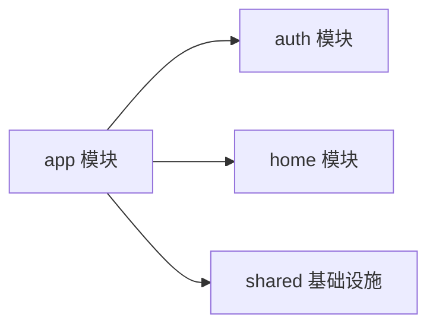

# DailyForge Frontend App 模块详细设计

> 版本：v1.1  
> 日期：2026-08-23  
> 模块归属：`frontend/src/app`

---

## 1. 模块目标

`app` 模块是前端应用层，用于组织所有模块共用的应用级能力。它不承载业务细节，主要负责：

- 组织页面路由
- 提供全局壳层
- 管理鉴权上下文
- 处理受保护路由访问控制

当前文件包括：

- `router.tsx`
- `layout/AppShell.tsx`
- `providers/AuthProvider.tsx`

---

## 2. 模块结构

```text
src/app
├─ layout
│  └─ AppShell.tsx
├─ providers
│  └─ AuthProvider.tsx
└─ router.tsx
```

---

## 3. router.tsx

### 3.1 作用

负责：

- 创建浏览器路由对象
- 装配公共壳层 `AppShell`
- 为需要登录的页面添加受保护路由

### 3.2 当前路由规则

公开路由（`GuestOnlyOutlet` 包裹，已登录跳 `/app`）：

| 路径 | 组件 | 说明 |
|------|------|------|
| `/` | `LoginPage` | 登录即首页 |
| `/register` | `RegisterPage` | 注册页 |

重定向：

| 路径 | 目标 | 说明 |
|------|------|------|
| `/login` | `/` | 旧登录地址重定向到首页 |

受保护路由（`ProtectedOutlet` 包裹，未登录跳 `/`）：

| 路径 | 组件 | 说明 |
|------|------|------|
| `/app` | `AppEntryPage` | 未完成 profile 引导则跳 `/profile/onboarding`，否则 `HomePage` |
| `/invite-code` | `RedeemInviteCodePage` | 邀请码兑换页 |
| `/ai-coach` | 重定向 | 重定向到 `/ai-coach/template-generation` |
| `/ai-coach/history` | `AiCoachHistoryPage` | tab 参数：template-generations / cycle-summaries |
| `/ai-coach/template-generation` | `TemplateGenerationPage` | AI 模板生成 |
| `/ai-coach/template-generation/tasks/:taskId` | `TemplateGenerationTaskPage` | AI 模板生成任务详情 |
| `/ai-coach/cycle-summary` | `CycleSummaryPage` | AI 周期总结 |
| `/ai-coach/cycle-summary/tasks/:taskId` | `CycleSummaryTaskPage` | AI 周期总结任务详情 |
| `/profile` | `ProfilePage` | 只读总览 |
| `/profile/edit` | `ProfileEditPage` | 基础档案 + 身体指标录入 |
| `/profile/metrics/history` | `BodyMetricHistoryPage` | 历史 + 删除最新 |
| `/profile/onboarding` | `ProfileOnboardingPage` | 引导页 |
| `/profile/ai-completion` | `ProfileAiCompletionPage` | AI 补录 |
| `/cycle-templates` | `CycleTemplatePage` | 训练模板列表 |
| `/cycle-templates/create` | `CycleTemplateCreatePage` | 新建模板 |
| `/cycle-templates/:templateId` | `CycleTemplateDetailPage` | 模板详情 |
| `/cycle-templates/:templateId/edit` | `CycleTemplateEditPage` | 模板编辑 |
| `/workout` | `WorkoutPage` | 训练工作台 |
| `/workout/history/:sessionId` | `WorkoutHistoryDetailPage` | 训练历史详情 |

### 3.3 ProtectedOutlet 实现逻辑

`ProtectedOutlet` 是受保护路由鉴权守卫。

执行逻辑：

1. 如果 `isBootstrapping=true`，显示加载占位。
2. 如果 bootstrap 结束但 `isAuthenticated=false`，跳转 `/`。
3. 只有登录态成立时才渲染子路由。

### 3.4 GuestOnlyOutlet 实现逻辑

`GuestOnlyOutlet` 是公开路由守卫，已实现，用于包裹 `/`、`/register` 这类仅访客可访问的页面。

执行逻辑：

1. 如果 `isBootstrapping=true`，显示加载占位。
2. 如果 `isAuthenticated=true`，跳转 `/app`（已登录用户不再停留在登录 / 注册页）。
3. 只有未登录时才渲染子路由。

### 3.5 当前优点

- 守卫逻辑集中
- 不需要每个页面都重复鉴权判断
- 便于后续加入角色判断或账户层级判断

### 3.6 后续扩展建议

后续可以扩展出：

- `RoleProtectedOutlet`
- `TierProtectedOutlet`

---

## 4. AppShell.tsx

### 4.1 作用

`AppShell` 是所有页面共用的应用框架层，负责：

- 全局背景与视觉基底
- 顶部导航
- 当前用户摘要展示
- 已登录 / 未登录状态下不同导航内容
- 子页面渲染容器

### 4.2 主要区域

当前页面结构包含：

1. 全局背景层
2. 网格纹理层
3. 页面内容容器
4. Header 导航栏
5. Main 路由出口

### 4.3 导航行为

未登录时展示：

- 登录（→ `/`）
- 注册（→ `/register`）

已登录时展示：

- 控制台（→ `/app`）
- 训练模板（→ `/cycle-templates`）
- 训练工作台（→ `/workout`）
- 个人资料（→ `/profile`）
- 邀请码（→ `/invite-code`）
- 用户摘要（用户名 + 账户层级标签）
- 退出按钮

### 4.4 与鉴权状态的关系

`AppShell` 通过 `useAuth()` 读取：

- `currentUser`
- `isAuthenticated`
- `logout`

从而根据登录状态动态调整导航和用户区域。

### 4.5 退出逻辑

点击退出按钮时调用 `logout()`。当前做法是：

- 由 `AuthProvider` 内部处理接口调用与本地状态清理
- `AppShell` 只负责触发

这种职责划分是合理的，因为壳层不应该持有退出流程的业务细节。

---

## 5. AuthProvider.tsx

### 5.1 作用

`AuthProvider` 是当前前端全局最重要的状态入口，负责维护用户会话状态。

### 5.2 内部状态

| 状态名 | 类型 | 作用 |
|------|------|------|
| `currentUser` | `CurrentUserResponse \| null` | 当前用户最新信息 |
| `session` | `StoredAuthSession \| null` | 本地 token 会话 |
| `isBootstrapping` | `boolean` | 是否正在校验已有登录态 |

### 5.3 暴露接口

| 方法 / 字段 | 作用 |
|------|------|
| `currentUser` | 当前用户信息 |
| `isAuthenticated` | 是否已登录 |
| `isBootstrapping` | 是否正在初始化会话 |
| `accessToken` | 当前 access token |
| `login` | 登录 |
| `register` | 注册 |
| `logout` | 退出登录 |
| `redeemInviteCode` | 兑换邀请码，返回 `Promise<string>`（兑换后的 accountTier） |

### 5.4 bootstrap 机制

当 Provider 初始化时：

1. 读取 `localStorage`
2. 如果没有本地会话，则结束初始化
3. 如果有本地 `accessToken`，调用 `/api/auth/me`
4. 成功则恢复登录态
5. 失败则清空本地会话

### 5.5 设计优势

- 当前用户状态统一
- 页面不需要自己处理 token 读取
- 路由守卫、布局、页面都能共用同一个登录态来源

### 5.6 设计边界

`AuthProvider` 已经处理：

- access token 自动续签：通过 `refreshSession` 结合 `shouldRefreshSession`（到期前 60s 阈值）在 bootstrap 阶段与定时器中进行自动续签；`/api/auth/me` 遇到可续签的 401 错误也会先刷新再重试。

当前尚未处理：

- 通用请求级 401 自动重试（目前仅 `loadCurrentUser` 对 `/api/auth/me` 做了刷新重试）
- 登录态变更跨标签页同步
- 登录后自动重定向来源页

这些可以在后续阶段扩展。

---

## 6. app 模块与其他模块关系


```mermaid
flowchart LR
    APP["app 模块"] --> AUTH["auth 模块"]
    APP --> HOME["home 模块"]
    APP --> SHARED["shared 基础设施"]
```

`app` 是组织者，不是业务拥有者。

