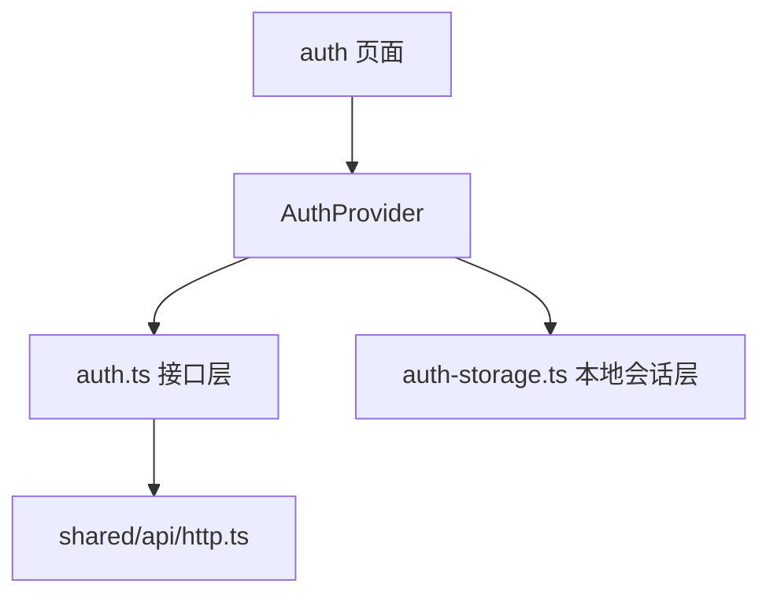

# DailyForge Frontend Auth 模块详细设计

> 版本：v1.0  
> 日期：2026-07-12  
> 模块归属：`frontend/src/features/auth`

---

## 1. 模块目标

前端 `auth` 模块用于承接 DailyForge 当前已实现的后端认证能力，并把这些能力转化为可以直接被页面使用的前端流程。

当前模块负责：

- 注册
- 登录
- 本地会话持久化
- 当前登录状态恢复
- 退出登录
- 邀请码兑换

---

## 2. 模块结构

```text
src/features/auth
├─ api
│  └─ auth.ts
├─ lib
│  └─ auth-storage.ts
└─ pages
   ├─ LoginPage.tsx
   ├─ RegisterPage.tsx
   └─ RedeemInviteCodePage.tsx
```

---

## 3. API 层设计

### 3.1 auth.ts 作用

`auth.ts` 是 `auth` 模块的前端接口适配层，负责：

- 定义模块内请求与响应类型
- 封装对后端 `auth` 接口的调用
- 让页面和 Provider 不直接依赖具体 URL 字符串

### 3.2 当前类型定义

当前已定义：

- `RegisterPayload`
- `LoginPayload`
- `RedeemInviteCodePayload`
- `AuthUserSummary`
- `AuthTokenResponse`
- `RegisterResponse`
- `CurrentUserResponse`
- `RedeemInviteCodeResponse`

### 3.3 当前接口函数

| 方法 | 对应后端接口 | 作用 |
|------|------|------|
| `register` | `POST /api/auth/register` | 注册新用户 |
| `login` | `POST /api/auth/login` | 登录并获得 token |
| `fetchCurrentUser` | `GET /api/auth/me` | 获取当前用户 |
| `logout` | `POST /api/auth/logout` | 退出登录 |
| `redeemInviteCode` | `POST /api/auth/redeem-invite-code` | 兑换邀请码 |

### 3.4 设计价值

将接口层单独抽出来后：

- 页面逻辑更干净
- Provider 不需要自己写 URL
- 接口类型集中维护
- 后端字段变化时更容易统一调整

---

## 4. 本地存储层设计

### 4.1 auth-storage.ts 作用

负责本地会话的读、写、删。

当前对外暴露：

- `getStoredAuthSession`
- `setStoredAuthSession`
- `clearStoredAuthSession`

### 4.2 存储键

当前固定键为：

`dailyforge.auth.session`

### 4.3 存储结构

```ts
type StoredAuthSession = {
  accessToken: string;
  refreshToken: string;
  expiresIn: number;
  user: AuthUserSummary;
};
```

### 4.4 异常处理

当 `localStorage` 中内容不是合法 JSON 时：

1. 自动移除坏数据
2. 返回 `null`

这是一个正确的容错策略，避免坏数据让整个应用初始化失败。

---

## 5. 模块数据流



说明：

- 页面不直接操作 `localStorage`
- 页面优先调用 `AuthProvider`
- `AuthProvider` 再统一编排接口和本地状态

---

## 6. 当前业务流程

### 6.1 注册流程

1. 用户填写邮箱、用户名、密码、确认密码、可选邀请码
2. 前端先校验两次密码是否一致
3. 调用 `register`
4. 成功后跳转登录页

### 6.2 登录流程

1. 用户输入邮箱和密码
2. 调用 `login`
3. 后端返回 token 与用户摘要
4. 前端写入本地会话
5. 更新内存中的当前用户
6. 跳转 `/app`

### 6.3 启动恢复流程

1. 应用启动
2. 读取 `localStorage`
3. 如果存在会话，调用 `fetchCurrentUser`
4. 成功则恢复登录态
5. 失败则清空本地会话

### 6.4 退出流程

1. 用户点击退出
2. 调用 `logout`
3. 清空本地会话
4. 重置 `currentUser`

### 6.5 邀请码兑换流程

1. 用户输入邀请码
2. 调用 `redeemInviteCode`
3. 成功后提示兑换成功
4. 更新 `currentUser.accountTier`

---

## 7. 当前边界与风险

### 7.1 无 token 自动刷新

当前如果 access token 过期，页面侧不会自动续签，用户需要重新登录。

### 7.2 登录错误只有文本 message

当前错误展示基于 `Error.message`，没有基于 `code` 做细粒度 UI 分支。

### 7.3 本地存储仅适合当前阶段

当前把 token 放在 `localStorage`，对初始化阶段足够，但后续若要更强调安全性，需要重新评估。

### 7.4 源码中存在中文乱码

当前页面源码中的部分中文字符串已有编码异常，后续应统一清理。

