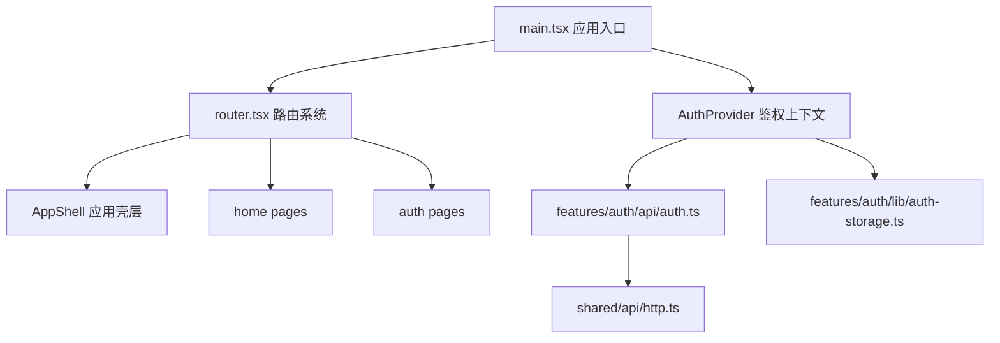

# DailyForge Frontend 技术总览

> 版本：v1.0  
> 日期：2026-07-12  
> 归属目录：`docs/frontend`

---

## 1. 文档定位

本文档用于描述 DailyForge 当前前端代码的总览结构，帮助阅读者先建立“前端整体怎么分层、各模块各负责什么”的认知，再进入具体模块文档。

配套文档如下：

- [初始化前端工程设计.md](/D:/Computer%20Science/DailyForge/docs/初始化前端工程设计.md)
- [app_DDD.md](/D:/Computer%20Science/DailyForge/docs/frontend/app_module/app_DDD.md)
- [shared_技术说明.md](/D:/Computer%20Science/DailyForge/docs/frontend/shared_infra/shared_技术说明.md)
- [auth_DDD.md](/D:/Computer%20Science/DailyForge/docs/frontend/auth_module/auth_DDD.md)
- [auth_页面实现.md](/D:/Computer%20Science/DailyForge/docs/frontend/auth_module/auth_页面实现.md)
- [home_DDD.md](/D:/Computer%20Science/DailyForge/docs/frontend/home_module/home_DDD.md)

---

## 2. 当前前端模块划分

当前前端采用“应用层 + 业务模块 + 共享基础设施”的组织方式。

### 2.1 应用层 `app`

负责：

- 路由组织
- Provider 挂载
- 全局壳层布局
- 应用级鉴权守卫

不负责：

- 具体业务接口
- 某个业务模块独有的状态
- 模块级页面实现

### 2.2 业务模块层 `features`

当前已存在：

- `auth`
- `home`

后续预期新增：

- `profile`
- `cycle-template`
- `training-session`
- `stats`

每个业务模块内部优先采用：

- `api`
- `lib`
- `pages`

如果后续模块变大，再增加：

- `components`
- `hooks`
- `types`

### 2.3 共享层 `shared`

用于存放横跨多个模块复用的能力。当前仅有：

- `shared/api/http.ts`

后续可以扩展为：

- `shared/components`
- `shared/constants`
- `shared/utils`
- `shared/types`

---

## 3. 当前路由地图

```text
/
├─ /                   LandingPage
├─ /login              LoginPage
├─ /register           RegisterPage
├─ /app                HomePage               (受保护)
└─ /invite-code        RedeemInviteCodePage   (受保护)
```

受保护页面统一经过 `ProtectedOutlet`。

---

## 4. 当前模块依赖关系



---

## 5. 当前状态管理策略

项目当前没有接入外部状态管理库，而是采用：

- React Context 管理全局鉴权态
- 页面级 `useState` 管理表单和交互态

这是一个有意识的初始化阶段选择，因为当前全局共享状态只有登录态，暂时不需要引入额外复杂度。

---

## 6. 当前接口组织策略

当前 API 组织方式是：

- 每个模块自己维护模块 API 文件
- 模块 API 文件基于 `shared/api/http.ts` 进行调用
- 页面只调用模块 API 或 Provider 暴露的方法

这样可以避免：

- 页面直接散落 `fetch`
- 请求头和错误处理重复书写
- 接口地址与类型定义分散

---

## 7. 当前样式组织策略

样式分为两层：

1. 全局基础样式：`src/styles/index.css`
2. 页面内 Tailwind 原子类

当前还没有抽离组件级样式系统，但这符合初始化阶段需求。

---

## 8. 当前文档维护建议

后续每新增一个前端业务模块，建议至少同步维护两类文档：

1. 一个模块设计文档  
说明模块职责、数据流、状态流、目录结构、后续扩展点。

2. 一个页面实现文档  
说明每个页面有哪些区域、交互、状态和接口调用行为。

这样未来改造前端时，不需要先通读大量 JSX 才能理解结构。

