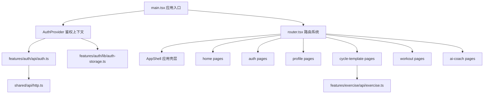

# DailyForge Frontend 技术总览

> 版本：v1.1  
> 日期：2026-08-23  
> 归属目录：`docs/frontend`

---

## 1. 文档定位

本文档用于描述 DailyForge 当前前端代码的总览结构，帮助阅读者先建立“前端整体怎么分层、各模块各负责什么”的认知，再进入具体模块文档。

配套文档如下：

- [初始化前端工程设计.md](/D:/Computer%20Science/DailyForge/docs/初始化前端工程设计.md)
- [app_DDD.md](/D:/Computer%20Science/DailyForge/docs/frontend/app_module/app_DDD.md)
- [shared_技术说明.md](/D:/Computer%20Science/DailyForge/docs/frontend/shared_infra/shared_技术说明.md)
- [auth_DDD.md](/D:/Computer%20Science/DailyForge/docs/frontend/auth_module/auth_DDD.md)
- [auth_页面实现.md](/D:/Computer%20Science/DailyForge/docs/frontend/auth_module/auth_页面实现.md)
- [home_DDD.md](/D:/Computer%20Science/DailyForge/docs/frontend/home_module/home_DDD.md)

---

## 2. 当前前端模块划分

当前前端采用“应用层 + 业务模块 + 共享基础设施”的组织方式。

### 2.1 应用层 `app`

负责：

- 路由组织
- Provider 挂载
- 全局壳层布局
- 应用级鉴权守卫

不负责：

- 具体业务接口
- 某个业务模块独有的状态
- 模块级页面实现

### 2.2 业务模块层 `features`

当前已存在 7 个业务模块：

- `auth` — 登录 / 注册 / 邀请码兑换
- `home` — 登录后控制台首页 `/app`
- `profile` — 个人资料总览 / 编辑 / 身体指标历史 / 引导 / AI 补录
- `exercise` — 系统动作库（供模板编辑器中的动作选择器使用）
- `cycle-template` — 训练模板（草稿 / 正式 / 详情 / 编辑）
- `workout` — 训练工作台 / 历史详情
- `ai-coach` — AI 模板生成 / AI 周期总结 / 任务历史（无独立 hub 页）

每个业务模块普遍包含以下目录（按需出现，并非每个模块都有全部）：

- `api`
- `components`
- `hooks`
- `lib`
- `pages`
- `types`

其中 `home` 目前只有 `pages`；`exercise` 没有 `pages`，仅作为模板编辑器的动作选择数据源使用。

### 2.3 共享层 `shared`

用于存放横跨多个模块复用的能力。当前有：

- `shared/api/http.ts` — `request<T>` 统一 API 封装
- `shared/lib/uuid.ts` — `generateUuid()`（兼容非安全上下文，供 AI 任务 `clientRequestId` 使用）

后续可以扩展为：

- `shared/components`
- `shared/constants`
- `shared/utils`
- `shared/types`

---

## 3. 当前路由地图

公开路由（`GuestOnlyOutlet` 包裹，已登录会跳 `/app`）：

| 路径 | 组件 | 说明 |
|------|------|------|
| `/` | `LoginPage` | 登录即首页（含产品介绍） |
| `/register` | `RegisterPage` | 注册页 |

重定向：

| 路径 | 目标 | 说明 |
|------|------|------|
| `/login` | `/` | 旧登录地址重定向到首页 |

受保护路由（`ProtectedOutlet` 包裹，未登录跳 `/`）：

| 路径 | 组件 | 说明 |
|------|------|------|
| `/app` | `AppEntryPage` | 未完成 profile 引导则跳 `/profile/onboarding`，否则 `HomePage` |
| `/invite-code` | `RedeemInviteCodePage` | 邀请码兑换页 |
| `/ai-coach` | 重定向 | 重定向到 `/ai-coach/template-generation` |
| `/ai-coach/history` | `AiCoachHistoryPage` | tab 参数：template-generations / cycle-summaries |
| `/ai-coach/template-generation` | `TemplateGenerationPage` | AI 模板生成 |
| `/ai-coach/template-generation/tasks/:taskId` | `TemplateGenerationTaskPage` | AI 模板生成任务详情 |
| `/ai-coach/cycle-summary` | `CycleSummaryPage` | AI 周期总结 |
| `/ai-coach/cycle-summary/tasks/:taskId` | `CycleSummaryTaskPage` | AI 周期总结任务详情 |
| `/profile` | `ProfilePage` | 只读总览 |
| `/profile/edit` | `ProfileEditPage` | 基础档案 + 身体指标录入 |
| `/profile/metrics/history` | `BodyMetricHistoryPage` | 历史 + 删除最新 |
| `/profile/onboarding` | `ProfileOnboardingPage` | 引导页 |
| `/profile/ai-completion` | `ProfileAiCompletionPage` | AI 补录 |
| `/cycle-templates` | `CycleTemplatePage` | 训练模板列表 |
| `/cycle-templates/create` | `CycleTemplateCreatePage` | 新建模板 |
| `/cycle-templates/:templateId` | `CycleTemplateDetailPage` | 模板详情 |
| `/cycle-templates/:templateId/edit` | `CycleTemplateEditPage` | 模板编辑 |
| `/workout` | `WorkoutPage` | 训练工作台 |
| `/workout/history/:sessionId` | `WorkoutHistoryDetailPage` | 训练历史详情 |

路由守卫：

- `ProtectedOutlet`：未登录跳 `/`
- `GuestOnlyOutlet`：已登录跳 `/app`
- `AppEntryPage`：未完成 profile onboarding 跳 `/profile/onboarding`

---

## 4. 当前模块依赖关系

```mermaid
flowchart TD
    MAIN["main.tsx 应用入口"] --> AUTH_PROVIDER["AuthProvider 鉴权上下文"]
    MAIN --> ROUTER["router.tsx 路由系统"]
    ROUTER --> APP_SHELL["AppShell 应用壳层"]
    ROUTER --> HOME_PAGES["home pages"]
    ROUTER --> AUTH_PAGES["auth pages"]
    ROUTER --> PROFILE_PAGES["profile pages"]
    ROUTER --> CYCLE_TEMPLATE_PAGES["cycle-template pages"]
    ROUTER --> WORKOUT_PAGES["workout pages"]
    ROUTER --> AI_COACH_PAGES["ai-coach pages"]
    AUTH_PROVIDER --> AUTH_API["features/auth/api/auth.ts"]
    AUTH_PROVIDER --> AUTH_STORAGE["features/auth/lib/auth-storage.ts"]
    AUTH_API --> HTTP["shared/api/http.ts"]
    CYCLE_TEMPLATE_PAGES --> EXERCISE_API["features/exercise/api/exercise.ts"]
```

---

## 5. 当前状态管理策略

项目当前没有接入外部状态管理库，而是采用：

- React Context 管理全局鉴权态
- 页面级 `useState` 管理表单和交互态

这是一个有意识的初始化阶段选择，因为当前全局共享状态只有登录态，暂时不需要引入额外复杂度。

---

## 6. 当前接口组织策略

当前 API 组织方式是：

- 每个模块自己维护模块 API 文件
- 模块 API 文件基于 `shared/api/http.ts` 进行调用
- 页面只调用模块 API 或 Provider 暴露的方法

这样可以避免：

- 页面直接散落 `fetch`
- 请求头和错误处理重复书写
- 接口地址与类型定义分散

---

## 7. 当前样式组织策略

样式分为两层：

1. 全局基础样式：`src/styles/index.css`
2. 页面内 Tailwind 原子类

当前还没有抽离组件级样式系统，但这符合初始化阶段需求。

---

## 8. 当前文档维护建议

后续每新增一个前端业务模块，建议至少同步维护两类文档：

1. 一个模块设计文档  
说明模块职责、数据流、状态流、目录结构、后续扩展点。

2. 一个页面实现文档  
说明每个页面有哪些区域、交互、状态和接口调用行为。

这样未来改造前端时，不需要先通读大量 JSX 才能理解结构。

