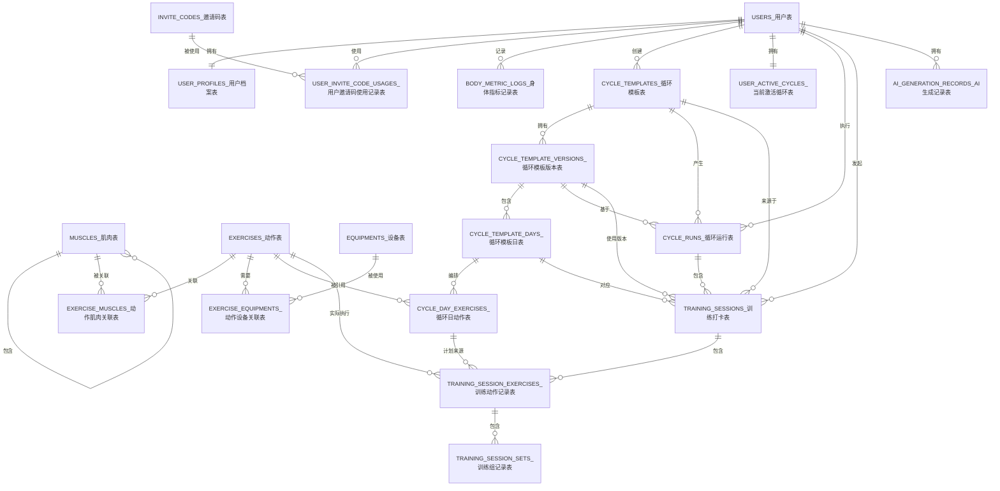

# DailyForge 数据库设计

## 1. 文档目标

本文档用于定义 DailyForge MVP 阶段的核心数据库模型，重点支撑以下业务能力：

- 用户管理与基础权限控制
- 邀请码带来的权益开通
- 循环训练模板创建、启用与调整
- 系统按循环自动推进训练日
- 动作级打卡、跳过和未完成原因记录
- 基于历史训练结果为下一轮循环提供 AI 或人工调整依据

## 2. 设计原则

本方案遵循以下原则：

- 模板与执行记录分离
- 模板版本化，避免历史计划被覆盖
- 当前运行状态单独建模
- 每一轮循环运行单独建模并可归档
- 力量训练与有氧训练统一建模，但保留扩展字段
- 动作与肌肉、设备使用多对多关系，而非单字段硬编码
- 权限与权益轻量建模，不引入复杂 RBAC
- 统计优先基于明细表生成，性能不足时再补汇总表

## 3. 核心业务抽象

DailyForge 的“计划”本质上不是固定的周计划或月计划，而是一个可循环执行的训练模板。

一个循环模板具备以下特点：

- 用户定义一个周期长度，范围为 1 到 7 天
- 周期内每一天配置不同动作与目标
- 模板确认启用后，系统维护当前进行到周期中的第几天
- 用户完成某一天训练后打卡，系统自动推进到下一天
- 当周期最后一天完成后，本轮循环自动归档，并开启下一轮循环
- 用户允许编辑当前正在运行的模板，但不允许修改已经完成打卡的训练日

因此本设计将训练业务抽象为：

- 循环模板
- 模板版本
- 模板日
- 模板日动作
- 当前激活循环状态
- 循环运行实例
- 训练打卡记录
- 动作执行记录
- 组级执行记录

## 4. 核心表清单

MVP 阶段建议优先实现以下数据表：

- `users`
- `user_profiles`
- `invite_codes`
- `user_invite_code_usages`
- `body_metric_logs`
- `user_current_body_metrics`
- `muscles`
- `equipments`
- `exercises`
- `exercise_muscles`
- `exercise_equipments`
- `cycle_templates`
- `cycle_template_versions`
- `cycle_template_days`
- `cycle_day_exercises`
- `cycle_runs`
- `user_active_cycles`
- `training_sessions`
- `training_session_exercises`
- `training_session_sets`
- `ai_generation_records`

## 5. 用户、权限与权益

### 5.1 `users`

用于存储账号主体信息，以及轻量的角色和权益类型。

建议字段：

- `id`
- `email`
- `password_hash`
- `user_name`
- `platform_role`
- `account_tier`
- `status`
- `last_login_at`
- `created_at`
- `updated_at`

字段说明：

- `platform_role`
  - 用于表示平台角色
  - 建议值：`user`、`admin`
- `account_tier`
  - 用于表示功能权益层级
  - 建议值：`basic`、`invited_ai`、`premium`

说明：

- `email` 应建立唯一索引
- `platform_role` 用于判断平台管理权限
- `account_tier` 用于判断 AI 功能、会员功能或配额差异

### 5.2 `user_profiles`

用于存储用户健身相关基础资料。

建议字段：

- `user_id`
- `gender`
- `birth_date`
- `height_cm`
- `training_level`
- `goal_type`
- `injury_notes`
- `created_at`
- `updated_at`

说明：

- `user_id` 建议作为主键并与 `users.id` 一一对应
- `goal_type` 可选值如减脂、增肌、保持健康

### 5.3 `invite_codes`

用于存储邀请码及邀请码可授予的权益。

建议字段：

- `id`
- `code`
- `information`
- `grant_type`
- `grant_value`
- `max_uses`
- `used_count`
- `expires_at`
- `status`
- `created_at`
- `updated_at`

字段说明：

- `information`
  - 表示邀请码的信息说明
  - 例如：首批内测用户、开放 AI 训练总结功能、合作渠道专用
- `grant_type`
  - 表示邀请码授予的权益类型
- `grant_value`
  - 表示邀请码授予的权益值，例如 `invited_ai`

说明：

- `code` 应建立唯一索引
- 邀请码可用于早期开放 AI 能力、会员体验资格等

### 5.4 `user_invite_code_usages`

用于记录用户使用邀请码的留痕。

建议字段：

- `id`
- `user_id`
- `invite_code_id`
- `used_at`

说明：

- 建议对 `(user_id, invite_code_id)` 建立唯一约束
- 便于后续追踪谁使用了哪个邀请码

## 6. 身体指标设计

### 6.1 `body_metric_logs`

用于存储用户身体指标的时间序列数据。

建议字段：

- `id`
- `user_id`
- `record_date`
- `weight_kg`
- `body_fat_percent`
- `bmi`
- `skeletal_muscle_percent`
- `body_water_percent`
- `basal_metabolic_rate_kcal`
- `waist_cm`
- `hip_cm`
- `waist_hip_ratio`
- `body_age`
- `body_type`
- `data_source`
- `note`
- `created_at`

字段说明：

- `body_fat_percent`
  - 体脂率
- `skeletal_muscle_percent`
  - 骨骼肌占比
- `body_water_percent`
  - 身体水分占比
- `basal_metabolic_rate_kcal`
  - 基础代谢
- `waist_hip_ratio`
  - 腰臀比
- `body_age`
  - 身体年龄
- `body_type`
  - 体型，如 `healthy`、`slim`、`overweight`、`obese`、`strong`
- `data_source`
  - 数据来源，如 `manual`、`smart_scale`

说明：

- 这些字段允许为空
- 应尽量保留原始测量值，而不只保留计算结果
- AI 在制定个性化训练建议时可参考这些指标
- 每条记录只保存本次真实填写的字段
- 未填写字段保持为空，不自动复制上一条记录的旧值

### 6.2 `user_current_body_metrics`

用于保存用户“当前已知的身体状态摘要”，作为 `body_metric_logs` 的读模型。

建议字段：

- `user_id`
- `current_weight_kg`
- `current_body_fat_percent`
- `current_bmi`
- `current_skeletal_muscle_percent`
- `current_body_water_percent`
- `current_basal_metabolic_rate_kcal`
- `current_waist_cm`
- `current_hip_cm`
- `current_waist_hip_ratio`
- `current_body_age`
- `current_body_type`
- `updated_at`

说明：

- `user_id` 建议作为主键，并与 `users.id` 一一对应
- 该表不保存历史，只保存当前已知最新值
- 各字段允许来自不同日期的最近一次非空记录
- 个人信息页面和 AI 功能优先读取该表，而不是每次扫描全部 `body_metric_logs`
- 当新增身体指标记录时，仅对本次实际填写的字段覆盖快照值
- 当删除最近一条身体指标记录时，应基于剩余历史重新计算该表

## 7. 肌肉、设备与动作库设计

### 7.1 `muscles`

用于表示可被训练的肌肉部位，并通过自关联表达包含关系。

建议字段：

- `id`
- `name`
- `code`
- `parent_id`
- `muscle_level`
- `sort_order`
- `is_active`
- `created_at`
- `updated_at`

字段说明：

- `parent_id`
  - 指向上级肌肉节点
- `muscle_level`
  - 表示层级，例如 `group`、`subgroup`

说明：

- 可表达如：
  - 胸大肌 -> 上沿、中部、下沿
  - 三角肌 -> 前束、中束、后束

### 7.2 `equipments`

用于表示训练设备或器械。

建议字段：

- `id`
- `name`
- `scene_type`
- `description`
- `is_active`
- `created_at`
- `updated_at`

字段说明：

- `scene_type`
  - 设备使用场景
  - 建议值：`home`、`gym`、`outdoor`、`both`

说明：

- 不建议在设备表中冗余记录锻炼肌肉
- 设备与肌肉关系可从动作表反查

### 7.3 `exercises`

用于存储动作库，包括系统默认动作与用户自定义动作。

建议字段：

- `id`
- `owner_user_id`
- `name`
- `exercise_type`
- `movement_type`
- `default_unit`
- `calorie_burn_reference`
- `calorie_reference_unit`
- `is_active`
- `created_at`
- `updated_at`

字段说明：

- `owner_user_id`
  - 为空表示系统动作
  - 不为空表示用户自定义动作
- `exercise_type`
  - 建议区分 `strength`、`cardio`、`mobility`
- `default_unit`
  - 例如 `kg`、`reps`、`seconds`、`km`
- `calorie_burn_reference`
  - 参考热量消耗值，不代表固定真实消耗
- `calorie_reference_unit`
  - 例如 `met`、`kcal_per_30min`

说明：

- 不再使用单一 `muscle_group` 字段
- 不再在动作主体表中硬编码设备信息

### 7.4 `exercise_muscles`

用于表示动作与肌肉的多对多关系。

建议字段：

- `id`
- `exercise_id`
- `muscle_id`
- `relation_type`
- `sort_order`

字段说明：

- `relation_type`
  - 建议值：`primary`、`secondary`

说明：

- 每个动作至少应有一个 `primary` 肌肉
- 同一动作可配置多个 `secondary` 肌肉

### 7.5 `exercise_equipments`

用于表示动作与设备的多对多关系。

建议字段：

- `id`
- `exercise_id`
- `equipment_id`
- `requirement_type`
- `sort_order`

字段说明：

- `requirement_type`
  - 建议值：`required`、`optional`、`alternative`

说明：

- 可表示某个动作必须设备、可选设备或替代设备

## 8. 循环模板设计

### 8.1 `cycle_templates`

用于表示用户的循环训练模板本体。

建议字段：

- `id`
- `user_id`
- `name`
- `cycle_length`
- `goal_type`
- `status`
- `current_version_id`
- `created_at`
- `updated_at`

字段说明：

- `cycle_length`
  - 周期长度，范围为 1 到 7
- `status`
  - 建议值：`draft`、`active`、`archived`
- `current_version_id`
  - 当前生效版本

说明：

- 一个用户可以创建多个循环模板
- 同一时间只允许一个模板处于激活运行状态

### 8.2 `cycle_template_versions`

用于保存循环模板的版本快照。

建议字段：

- `id`
- `template_id`
- `version_no`
- `source_type`
- `change_note`
- `created_at`

字段说明：

- `version_no`
  - 模板的第几版，建议从 1 开始递增
- `source_type`
  - 建议值：`manual`、`ai`
- `change_note`
  - 记录本次版本调整说明

说明：

- 用户编辑模板后，不应直接覆盖当前生效版本
- 必须在用户点击“确认启用模板”后，才将新版本切换为当前版本
- 正在运行的模板允许调整，但应通过新版本承接，而不是直接污染旧版本

### 8.3 `cycle_template_days`

用于表示一个循环模板版本中的某一天。

建议字段：

- `id`
- `template_version_id`
- `day_index`
- `day_name`
- `focus`
- `notes`

字段说明：

- `day_index`
  - 周期中的第几天，取值范围应为 `1 ~ cycle_length`
- `day_name`
  - 例如 `Push`、`Pull`、`Legs`、`有氧`
- `focus`
  - 当天训练重点

说明：

- 展示排序直接按 `day_index`
- 应对 `(template_version_id, day_index)` 建立唯一约束

### 8.4 `cycle_day_exercises`

用于表示某个循环日下的训练动作及目标值。

建议字段：

- `id`
- `template_day_id`
- `exercise_id`
- `exercise_name_snapshot`
- `target_sets`
- `target_reps_min`
- `target_reps_max`
- `target_weight_kg`
- `target_duration_seconds`
- `target_rest_seconds`
- `target_rpe`
- `target_extra_json`
- `notes`
- `sort_order`

字段说明：

- `exercise_name_snapshot`
  - 动作名称快照，防止动作库后续改名影响历史数据
- `target_extra_json`
  - 用于扩展特殊动作目标，例如：
  - `distance_km`
  - `pace`
  - `incline_percent`
  - `resistance_level`
  - `cadence_rpm`
  - `heart_rate_zone`

## 9. 循环运行与自动推进

### 9.1 `cycle_runs`

用于表示某个模板的一次完整循环运行实例。

建议字段：

- `id`
- `user_id`
- `template_id`
- `template_version_id`
- `run_no`
- `status`
- `started_at`
- `completed_at`
- `archived_at`
- `created_at`
- `updated_at`

字段说明：

- `run_no`
  - 第几轮循环
- `status`
  - 建议值：`active`、`completed`、`archived`

说明：

- 当用户启用模板并开始执行时，应创建一条新的 `cycle_runs`
- 当该循环的最后一天打卡完成后，这一轮应自动归档

### 9.2 `user_active_cycles`

用于表示用户当前正在运行的循环模板及推进状态。

建议字段：

- `user_id`
- `template_id`
- `template_version_id`
- `current_run_id`
- `current_day_index`
- `last_session_id`
- `activated_at`
- `updated_at`

字段说明：

- `current_run_id`
  - 当前正在执行的循环运行实例
- `current_day_index`
  - 当前默认进入的训练日

说明：

- 应对 `user_id` 建立唯一约束
- 该表用于支撑“系统自动推进到下一天”的业务逻辑

## 10. 训练打卡设计

### 10.1 `training_sessions`

用于记录用户完成某一天训练后的整次打卡结果。

建议字段：

- `id`
- `user_id`
- `cycle_run_id`
- `template_id`
- `template_version_id`
- `template_day_id`
- `day_index`
- `session_no`
- `started_at`
- `completed_at`
- `overall_feeling`
- `notes`
- `created_at`

字段说明：

- `cycle_run_id`
  - 表示本次训练属于哪一轮循环
- `session_no`
  - 在该模板下的训练序号

说明：

- 模板日与具体自然日不强绑定
- 训练时间只用于记录实际发生时间和训练时长

### 10.2 `training_session_exercises`

用于记录本次训练中每个动作的执行结果。

建议字段：

- `id`
- `session_id`
- `cycle_day_exercise_id`
- `exercise_id`
- `exercise_name_snapshot`
- `exercise_status`
- `planned_snapshot_json`
- `actual_summary_json`
- `feeling`
- `failure_reason`
- `adjustment_note`
- `sort_order`

字段说明：

- `exercise_status`
  - 建议值：`completed`、`skipped`、`unfinished`
- `failure_reason`
  - 跳过或未完成原因

说明：

- 用户必须为当天每个动作都做状态标记，才能提交本次打卡
- 若动作为 `skipped` 或 `unfinished`，建议必须填写原因
- 该表是 AI 分析和下一轮模板优化的重要依据

建议的 `failure_reason` 预设项包括：

- `fatigue`
- `equipment_unavailable`
- `warmup_overload`
- `pain_or_discomfort`
- `time_limit`
- `other`

### 10.3 `training_session_sets`

用于记录动作下每一组的实际执行情况。

建议字段：

- `id`
- `session_exercise_id`
- `set_no`
- `planned_weight_kg`
- `actual_weight_kg`
- `planned_reps`
- `actual_reps`
- `planned_duration_seconds`
- `actual_duration_seconds`
- `actual_extra_json`
- `is_completed`
- `set_note`

说明：

- `actual_extra_json` 可扩展记录有氧动作特殊执行指标，例如：
  - `distance_km`
  - `pace`
  - `incline_percent`
  - `resistance_level`
  - `cadence_rpm`
  - `heart_rate_avg`

## 11. AI 调用记录设计

### 11.1 `ai_generation_records`

用于存储 AI 生成或分析过程的记录，便于追踪和优化。

建议字段：

- `id`
- `user_id`
- `scenario`
- `related_entity_type`
- `related_entity_id`
- `provider`
- `model`
- `prompt_version`
- `input_json`
- `output_json`
- `status`
- `latency_ms`
- `error_message`
- `created_at`

说明：

- `scenario` 例如：`cycle_generate`、`cycle_adjust`、`nutrition_advice`
- 该表不作为业务真相表使用

## 12. 表关系说明

核心关系如下：

- `users 1 -> 1 user_profiles`
- `users 1 -> n user_invite_code_usages`
- `users 1 -> n body_metric_logs`
- `users 1 -> 1 user_current_body_metrics`
- `users 1 -> n cycle_templates`
- `users 1 -> n cycle_runs`
- `users 1 -> 1 user_active_cycles`
- `users 1 -> n training_sessions`
- `users 1 -> n ai_generation_records`
- `invite_codes 1 -> n user_invite_code_usages`
- `muscles 1 -> n muscles`
- `exercises 1 -> n exercise_muscles`
- `muscles 1 -> n exercise_muscles`
- `exercises 1 -> n exercise_equipments`
- `equipments 1 -> n exercise_equipments`
- `cycle_templates 1 -> n cycle_template_versions`
- `cycle_template_versions 1 -> n cycle_template_days`
- `cycle_template_days 1 -> n cycle_day_exercises`
- `cycle_templates 1 -> n cycle_runs`
- `cycle_runs 1 -> n training_sessions`
- `training_sessions 1 -> n training_session_exercises`
- `training_session_exercises 1 -> n training_session_sets`

## 13. 关键业务规则

### 13.1 模板切换规则

- 用户编辑模板后，不直接影响当前运行版本
- 只有用户点击“确认启用模板”后，才切换到新版本
- 切换时应同时更新：
  - `cycle_templates.current_version_id`
  - `user_active_cycles.template_version_id`

### 13.2 正在运行版本的编辑规则

- 允许用户编辑当前正在运行的模板
- 但不允许修改已经打卡完成的训练日
- 推荐实现方式：
  - 基于当前版本复制出一个新版本
  - 已打卡日保持不可变
  - 未打卡日允许调整
  - 用户确认后切换到新版本继续执行

说明：

- 不建议直接原地修改已运行版本，否则会污染历史解释语义

### 13.3 自动推进与归档规则

- 系统默认展示 `user_active_cycles.current_day_index` 对应的模板日
- 用户完成打卡后，系统推进到下一天
- 若当前天不是最后一天：
  - 更新 `current_day_index + 1`
- 若当前天是最后一天：
  - 当前 `cycle_runs` 标记为 `archived`
  - 创建下一轮新的 `cycle_runs`
  - `user_active_cycles.current_run_id` 指向新的循环运行实例
  - `user_active_cycles.current_day_index` 重置为 `1`

### 13.4 打卡提交规则

- 用户必须对当天所有动作完成状态标记
- 动作状态允许为：
  - `completed`
  - `skipped`
  - `unfinished`
- 若为 `skipped` 或 `unfinished`，建议必须填写原因
- 只有整天所有动作都处理完毕，才允许提交打卡

### 13.5 数据快照规则

- 模板动作表保留 `exercise_name_snapshot`
- 打卡动作表保留 `planned_snapshot_json`
- 打卡动作表保留 `actual_summary_json`

说明：

- 即使用户后续修改动作名、重量或模板结构，历史训练记录仍应准确反映当时情况

## 14. 索引与约束建议

建议实现以下唯一约束和索引：

### 唯一约束

- `users.email`
- `invite_codes.code`
- `user_profiles.user_id`
- `user_active_cycles.user_id`
- `user_invite_code_usages(user_id, invite_code_id)`
- `cycle_template_versions(template_id, version_no)`
- `cycle_template_days(template_version_id, day_index)`

### 常用查询索引

- `body_metric_logs(user_id, record_date)`
- `user_current_body_metrics(user_id)`
- `cycle_templates(user_id, status)`
- `cycle_runs(user_id, template_id, run_no)`
- `training_sessions(user_id, created_at)`
- `training_sessions(cycle_run_id, day_index)`
- `training_session_exercises(session_id, sort_order)`
- `training_session_sets(session_exercise_id, set_no)`
- `exercise_muscles(exercise_id, relation_type)`
- `exercise_equipments(exercise_id, requirement_type)`
- `ai_generation_records(user_id, scenario, created_at)`

## 15. Mermaid ER 图

以下 ER 图用于表达当前 MVP 阶段的核心逻辑关系，重点展示实体之间的关联，不展开所有字段细节。

## 16. MVP 暂不实现的表

以下内容建议暂不在 MVP 阶段落表：

- 完整食物库
- 餐次记录表
- 食物摄入明细表
- 社交关系表
- 评论与互动表
- 复杂统计汇总表
- 复杂权限配置表

原因：

- 当前 MVP 的核心价值在于循环模板、训练执行记录和反馈闭环
- 权限体系当前较轻，不需要引入 RBAC 或复杂授权表

## 17. 后续扩展方向

如果产品进入下一阶段，可考虑补充以下方向：

- `nutrition_targets` 与 `nutrition_logs`
- `user_daily_stats` 与 `user_weekly_stats`
- `exercise_pr_records`
- `template_adjustment_history`
- `notification_tasks`
- `membership_orders`

## 18. 结论

本数据库设计以“循环模板 + 自动推进 + 循环归档 + 动作级打卡 + 原因反馈”为核心，能够较完整地支持 DailyForge 当前最重要的训练闭环：

- 用户定义分化周期
- 系统按周期日自动推进
- 用户完成动作后进行精细打卡
- 系统保留动作结果和失败原因
- 每轮循环可独立归档和统计
- AI 或用户可根据历史记录优化下一轮训练模板

这套模型避免了将项目误建成传统日历计划系统，更贴合 DailyForge 真实的训练产品形态，也为后续 AI 驱动的训练调整、权限扩展和会员权益扩展预留了清晰的数据基础。
